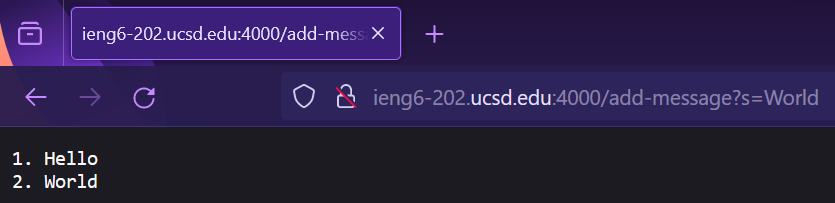

# Part 1

> StringServer.java:

```java
import java.io.IOException;
import java.net.URI;

class Handler implements URLHandler {
    String[] messages = {};

    public String handleRequest(URI url) {
       String path = url.getPath();
       String query = url.getQuery();


       if (path.equals("/add-message")) {
        if (query != null && query.length() >= 3 && query.contains("s=")) {
            this.appendMessages(query.split("=")[1]);
        } else {
            return "Invalid query, the URL must contain an s query.";
        }
       }

       if (messages.length == 0) {
	    return "No messages to display.";
       } else {
	    return this.formatMessages();
       }
    }

    private void appendMessages(String s) {
        String[] newArr = new String[this.messages.length + 1];
        for (int i = 0; i < this.messages.length; i++) {
            newArr[i] = this.messages[i];
        }
        newArr[newArr.length - 1] = s;
        this.messages = newArr;
    }

    private String formatMessages() {
        String list = "";
        for (int i = 0; i < this.messages.length; i++) {
            list += String.format("%d. %s\n", i + 1, this.messages[i]);
        }
        return list;
    }
}

class StringServer {
    public static void main(String[] args) throws IOException {
        if(args.length == 0){
            System.out.println("Missing port number! Try any number between 1024 to 49151");
            return;
        }

        int port = Integer.parseInt(args[0]);

        Server.start(port, new Handler());
    }
}
```

I start the server by inputting `java StringServer 4000` in the console of the ieng6 computer, what this does is it calls the `main` function of the `StringServer` class and passes in the string 4000 as a an argument. Within this `main` method, 4000 is parsed and converted into an integer which is then passed into the `Server` class's `start` method along with an object created from the `Handler` class.


A new `URI` object is created from the request URL string, which is `http://ieng6-202.ucsd.edu:4000/add-message?s=Hello`, this `URI` object is passed into the `handleRequest` method on the `Handler` object. In the `handleRequest` method, the methods `getPath` and `getQuery` are called on the `URI` object which return the path and query, respectively, as strings. The `equals` method is called on the path string to check if the path is correct, since it is the methods `length` and `contains` are called on the query string. These methods are used together to check if the query is formatted correctly. Since the query is formatted correctly, the `appendMessages` custom method is called on the `Handler` object, this method appends the s query string to the `messages` field in the `Handler` object which looks like `{"Hello")` after the method is called. The string after the = sign in the query is passed into the `appendMessages` method, which is produced with the `split` method on the query string with = as the argument. After this, the `formatMessages` method is called on the `Handler` object, this returns a string formatted as a list containing the contents of the `messages` field.



Similarly, a new `URI` object is created from the request URL, which is `http://ieng6-202.ucsd.edu:4000/add-messages`, and is passed to the `handleRequest` method in the `Handler` object. Again, within the `handleRequest` method the methods `getPath` and `getQuery` are called on the `URI` object and return the path and query, respectively, as strings. The `equals` method is called on the path to check whether it is correct, and it is. The if statement within the if statement checks whether the query is valid or not, and since in this case it is not, the if statement fails and the else statement executes. As a result, the string `"Invalid query, the URL must contain an s query."` is returned, and that is what is displayed on the webpage. In this case the `appendMessages` method is never called on the `Handler` object and as a result the `messages` field is never altered, so it remains as `{}`.

# Part 2


The key my computer uses to log into ieng6 is held in `C:\Users\saber\.ssh\id_ed25519`. The `id_ed25519.pub` file contains the public key which other computers, in this case ieng6, use to compare to my private key.


The `authorized_keys` file located at `/home/linux/ieng6/cs15lfa23/cs15lfa23cg/.ssh/authorized_keys` in ieng6 contains a list of authorized ssh keys, my public key is in this file.


Logging onto ieng6 when my computer is authorized produces this terminal interaction.

# Part 3

Part of lab 3 was sending the public ssh key from our personal machines to the remote ieng6 machine. Rather than simply copying and pasting the contents of our machine's public key into the `authorized_keys` file in ieng6, we were encouraged to use a new command. This command, `scp`, is similar to the `cp` command which users can use to copy file contents from one location to another locally. However, `scp` sends the contents of a local file to a remote machine, in this case we sent the contents of our public key to the necessary location in ieng6. This was an interesting thing to learn and will be useful in the future.
