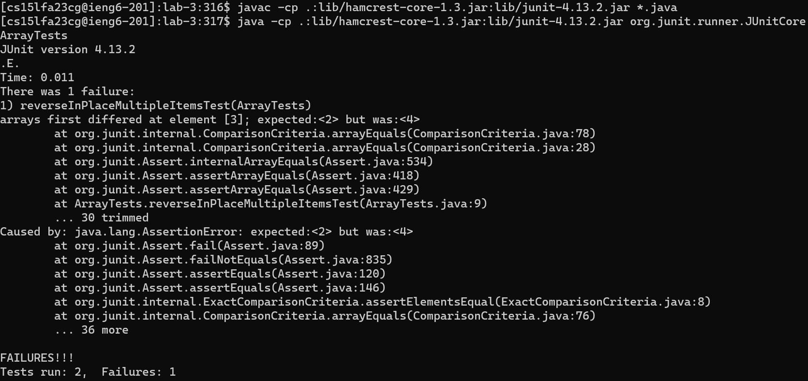

# Part 1: Bugs

Failure inducing test:
```java
@Test
public void reverseInPlaceMultipleItemsTest() {
  int[] input = {1, 2, 3, 4, 5};
  ArrayExamples.reverseInPlace(input);
  assertArrayEquals(new int[]{5, 4, 3, 2, 1}, input);
}
```

Non-failure inducing test:
```java
@Test
public void reverseInPlaceTestSingleItemTest() {
  int[] input = {1};
  ArrayExamples.reverseInPlace(input);
  assertArrayEquals(new int[] {1}, input);
}
```

Result of running the tests above:


Original `ArrayExamples.reverseInPlace` code:
```java
static void reverseInPlace(int[] arr) {
  for (int i = 0; i < arr.length; i += 1) {
    arr[i] = arr[arr.length - i - 1];
  }
}
```

Fixed `ArrayExamples.reverseInPlace` code:
```java
static void reverseInPlace(int[] arr) {
  for (int i = 0; i < arr.length / 2; i++) {
    int temp = arr[i];
    arr[i] = arr[arr.length - 1 - i];
    arr[arr.length - 1 - i] = temp;
  }
}
```

In the original `ArrayExamples.reverseInPlace` it iterated through the entire array, and while at first it would change the left half of the array to the proper values, it didn't change the corresponding value on the other side of the array, this was the first problem. The other problem was that after the `for` loop reached the middle of the array, it would start replacing the values on the right half of the array with those on the left half, but since the values on the left half were already changed what ended up happening was the array was mirrored. So an input of `{1, 2, 3, 4, 5}` would turn into `{5, 4, 3, 4, 5}`. What my fix did was it replaced both values on corresponding halves of the array and only iterated over the array for half its length.

# Part 2: Researching `grep` command-line options

Its important to note that the examples I provide correspond to the following file structure:
```
docsearch/
  |- [files...]
  |-  technical/
    |- 911report/
      |- [files...]
    |- biomed/
      |- [files...]
    |- government/
      |- [files...]
    |- plos/
      |- [files...]
```
Where my working directory will be `docsearch`.

## `-i` or `--ignore-case`
Causes `grep` to ignore casing on the pattern to search.
```console
[user@ieng6]:docsearch:1$ grep [-i / --ignore-case] [PATTERN] [FILES...]
```

> Example 1:
```console
[user@ieng6]:docsearch:1$ grep -i "ANNOTATION-BASED" technical/plos/pmed.0020273.txt
          annotation-based pathway database, which classified differentially expressed genes into
```
As you can see here, I passed in an all uppercase pattern. However, the `-i` option matched all patterns in the given directories which were the same string but with different casing.

> Example 2:
```console
[user@ieng6]:docsearch:1$ grep --ignore-case "crohn" technical/plos/pmed.0020273.txt
          characterized by inflammatrion of the bowel, specifically ulcerative colitis (UC) and Crohn
```
Here I passed in an all lowercase string and the pattern matched a line with the term "Crohn".

This option is helpful if you want to find a string which you might not know the exact casing of. I personally have used this many times to match some sort of hardware ID where I don't want to have to worry about what exactly the casing was.

## `-r` or `--recursive`
Causes `grep` to recursively search through all files in a specified directory for the given pattern.
```console
[user@ieng6]:docsearch:1$ grep [-r / --recursive] [PATTERN] [FILES...]
```

> Example 1:
```console
[user@ieng6]:docsearch:1$ grep -r "unavoidable" technical
technical/911report/chapter-3.txt:           subject to unavoidable misenterpretation and misrepresentation-and probably
technical/biomed/1471-2105-3-14.txt:           seem unavoidable (at least for initial, prioritizing
technical/biomed/1472-6750-2-13.txt:           this work, unavoidable in PCR. With a proper configuration
...
technical/government/Env_Prot_Agen/ctf7-10.txt:           variability and sometimes unavoidable anomalies in biological data.
...
technical/plos/journal.pbio.0020297.txt:           unavoidable) recursive quest. Understanding why some concepts are difficult to learn may 
```
Here `grep` is recursively searching through the `technical` directory for any files which match the provided pattern. The output shows the different subdirectories within `technical` which were searched through.

> Example 2:
```console
[user@ieng6]:docsearch:1$ grep --recursive "unavoidable" technical/biomed
technical/biomed/1471-2105-3-14.txt:           seem unavoidable (at least for initial, prioritizing
technical/biomed/1472-6750-2-13.txt:           this work, unavoidable in PCR. With a proper configuration
technical/biomed/1472-6785-2-6.txt:           collected. Due to the unavoidable tentativeness in
...
technical/biomed/gb-2002-3-5-research0021.txt:           because of this unavoidable background. The PGMinvrpt
```
Here `grep` recursively searches through the `technical/biomed` directory for the same pattern as the first example. The output shows that the only files matched were within `technical/biomed`. 

This option is useful for searching through a large amount of files, such as in the `technical` directory and its sub-directories, for a pattern.

## `-l` or `--files-with-matches`
Instead of outputing specific lines and each file name of the file they come from, `grep` will output only the names of the files where the pattern was matched.
```console
[user@ieng6]:docsearch:1$ grep [-l / --files-with-matches] [PATTERN] [FILES...]
```

> Example 1:
```console
[user@ieng6]:docsearch:1$ grep -l "unavoidable" technical/biomed/*
technical/biomed/1471-2105-3-14.txt
technical/biomed/1472-6750-2-13.txt
technical/biomed/1472-6785-2-6.txt
technical/biomed/1472-684X-2-1.txt
technical/biomed/1472-6904-3-1.txt
technical/biomed/1472-6963-3-7.txt
technical/biomed/gb-2002-3-12-research0071.txt
technical/biomed/gb-2002-3-5-research0021.txt
```
This option causes the ouput to be only the names of the files for each pattern matched in all files in `technical/biomed`.

> Example 2:
```console
[user@ieng6]:docsearch:1$ grep --files-with-matches "patterns is" technical/plos/*
technical/plos/journal.pbio.0020406.txt
technical/plos/pmed.0020005.txt
```
The output is only the names of the files in which the pattern was matched in the files in `technical/plos`.

The `-l` option is useful when you want to find only the names of files, and don't necessarily want a long block of output which can be difficult to read. This can also be useful to use with other commands such as passing in each of the file names to another `grep` command to look for more specific patterns.

## `-v` or `--invert-match`
Instead of selecting matching lines, `grep` will select non-matching lines.
```console
[user@ieng6]:docsearch:1$ grep [-v / --invert-match] [PATTERN] [FILES...]
```

> Example 1:
```console
[user@ieng6]:docsearch:1$ grep -v
```
some stuff here

> Example 2:
```console
[user@ieng6]:docsearch:1$ grep --invert-match
```
some more stuff here

some even more stuff here

I found all the information above for each option through the `man` command.

---

[Back to homepage](https://avvyxx.github.io/cse15l-lab-reports/)
