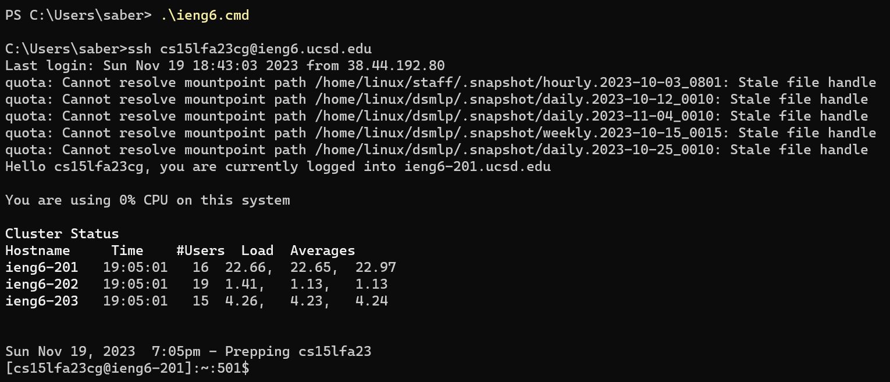
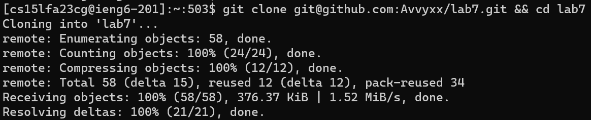
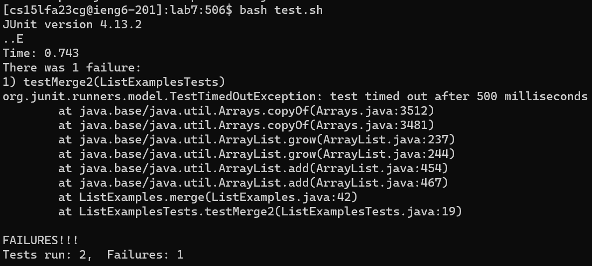
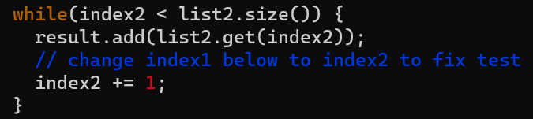
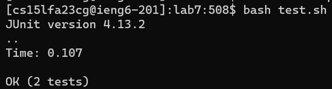
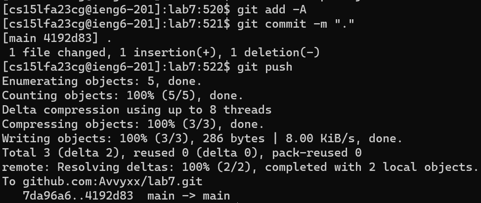

# Lab Report 4: Vim

The purpose of this lab was to explore potential ways one might speed up their workflow. To this effect I created a script file on my personal machine that, when ran, runs the ssh command to log onto the ieng6 machine. This saves a significant amount of time when having to work remotely.

## Logging onto ieng6

Keystroke sequence: `ie<tab><enter>`

Autofilled the name of the script meant to ssh into the ieng6 machine and runs it.

## Cloning our fork of the repository

Keystroke sequence: `git clo<tab><ctrl + v> && cd lab7<enter>`

First autofilled the rest of the `git clone` command, then pasted the ssh url of my forked repo. The two ampersands tell the terminal to run the command `cd lab7` after the first command has been completed.

## Running tests to demonstrate that they fail

Keystroke sequence: `bash t<tab><enter>`

Autofilled the name of the bash test script and ran it.

## Fixing the bug in ListExamples.java using vim

Keystroke sequence: `vim L<tab>.<tab><enter>`

This sequence of keystrokes opened the ListExamples.java file in vim.

While in vim: `/index2 < list2<enter>n3jexi2<esc>:wq<enter>`

First search the ListExamples.java file for any instances of the string "index2 < list2", then jumped to each next instance until I found the right one. Then it jumped down 3 lines, placed the carat at the end of the first word and replaced the 1 in the index1 variable with 2 to reference the correct variable, then saved the buffer and exit vim.

## Running tests again to demonstrate that they succeed

Keystroke sequence: `<up<up><enter>`

Went up 2 times in my command history, which would be the `bash test.sh` command, and ran it again to show that the tests passed this time.

## Committing and pushing any changes to the repository

Keystroke sequence 1: `git add -A<enter>`

Added the changes made to the ListExamples.java file to the changes in the git repo.

Keystroke sequence 2: `git com<tab> -m "."<enter>`

First autofilled the rest of the `git commit` command and committed the added changes to the repo with the message of ".".

Keystroke sequence 3: `git push`

Pushed the committed changes to the Github repo.

---

[Back to homepage](https://avvyxx.github.io/cse15l-lab-reports/)
