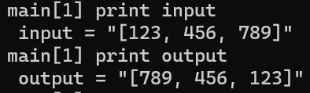
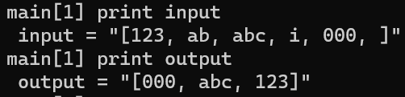

# Lab report 5: Putting it All Together

The purpose of this lab report is to design a debugging scenario between a student and a TA to demonstrate our understanding of the debugging process.

## Part 1: Debugging Scenario

Original student post:

Hello, I'm having some trouble implementing this filter method, it should take a List and create a new List with only the elements of the original List that returned true from a 
StringChecker class.


TA answer:

Hey! Could you try dumping each of the Lists in jdb to see exactly what is in each?

Student answer:

It seems the output lists are in the reverse order than what I expected.





Taking a look at my implementation, it seems that all elements added to the new List are added to the beginning, so removing the 0 should fix this.
```java
static List<String> filter(List<String> list, StringChecker sc) {
    List<String> result = new ArrayList<>();
    for(String s: list) {
      if(sc.checkString(s)) {
        result.add(0, s);
      }
    }
    return result;
}
```

## Setup:

Directory and file structure:

The working directory is `\home\user\lab-7`
```
lab-7/
  |- ListExamples.java
  |- ListExamplesTests.java
  |- test.sh
```

File contents:

> ListExamples.java
```java
import java.util.ArrayList;
import java.util.List;

interface StringChecker { boolean checkString(String s); }

class ListExamples {
  static List<String> filter(List<String> list, StringChecker sc) {
    List<String> result = new ArrayList();
    for(String s : list) {
      if (sc.checkString(s)) result.add(0, s);
    }
    return result;
  }
}
```

> ListExamplesTests.java
```java
import static org.junit.Assert.;
import org.junit.;
import java.util.*;
import java.util.ArrayList;

class LongStringChecker implements StringChecker {
        public boolean checkString(String s) {
                return s.length() >= 3;
        }
}

public class ListExamplesTests {
        @Test
        public void testFilter() {
                List<String> input = new ArrayList<String>(Arrays.asList("123", "ab", "abc", "i", "000", ""));
                List<String> output = ListExamples.filter(input, new LongStringChecker());
                assertArrayEquals(new String[]{"123", "abc", "000"}, output.toArray());
        }

        @Test
        public void testFilter2() {
                List<String> input = new ArrayList<String>(Arrays.asList("123", "456", "789"));
                List<String> output = ListExamples.filter(input, new LongStringChecker());
                assertArrayEquals(new String[]{"123", "456", "789"}, output.toArray());
        }
}
```

> test.sh
```bash
javac -cp .:lib/hamcrest-core-1.3.jar:lib/junit-4.13.2.jar *.java
java -cp .:lib/hamcrest-core-1.3.jar:lib/junit-4.13.2.jar org.junit.runner.JUnitCore ListExamplesTests
```

Commands ran to trigger bug:
`bash test.sh`

Since the `filter` method was always adding to the 0th index in the returned List, the result List had elements in the reverse order of what it should be. Removing the first argument to the call of `result.add` fixed the error.

## Part 2: Reflection

During the second half of this quarter, we were taught how to create bash scripts and use them to run multiple commands to produce a meaningful output. This was interesting as, throughout the quarter, I wondered how much more use individual commands could have. This as well as using Vim to edit files seem like useful skills to have.

---

[Back to homepage](https://avvyxx.github.io/cse15l-lab-reports/)
