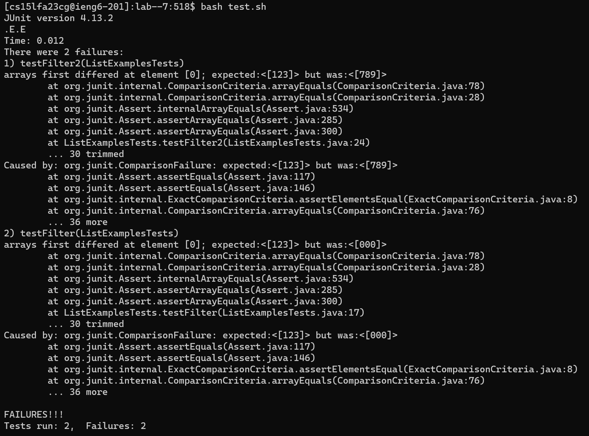
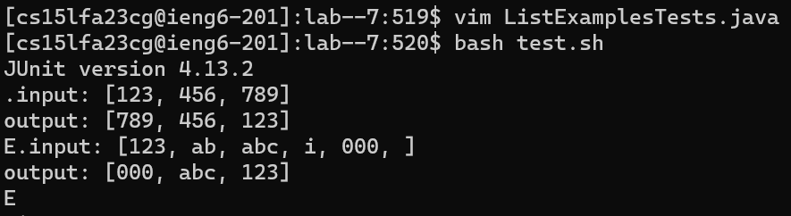

# Lab report 5: Putting It All Together

The purpose of this lab report is to design a debugging scenario between a student and a TA to demonstrate our understanding of the debugging process.

## Part 1: Debugging Scenario

Original student post:

Hello, I'm having some trouble implementing this filter method, it should take a List and create a new List with only the elements of the original List that returned true from a 
StringChecker class.

TA answer:

Hey! Could you try logging each of the Lists to see exactly what is in each?

Student answer:

It seems the output lists are in the reverse order than what I expected, 

## Part 2: Reflection

During the second half of this quarter, we were taught how to create bash scripts and use them to run multiple commands to produce a meaningful output. This was interesting as, throughout the quarter, I wondered how much more use individual commands could have. This as well as using Vim to edit files seem like useful skills to have.

---

[Back to homepage](https://avvyxx.github.io/cse15l-lab-reports/)
